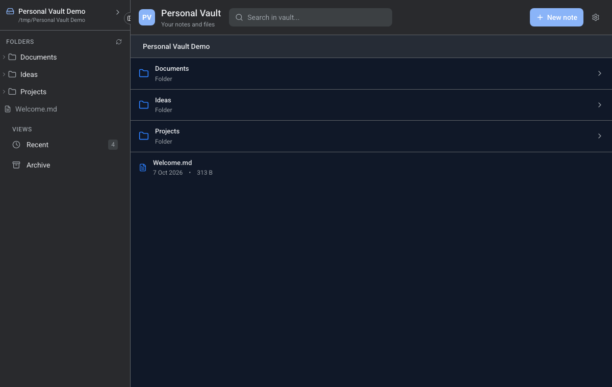
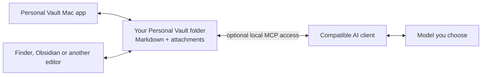

# Personal Vault

**Keep your AI memory in a folder you own — not inside one model or app.**

Personal Vault is a simple Mac app for keeping notes, decisions, project context and attachments as ordinary readable files. You can browse them in the app, open them in Finder or any Markdown editor, and choose when an AI client may use them.

[**Download Personal Vault for Mac — Apple Silicon (.dmg)**](https://github.com/personal-ai-systems/personal-vault-ui/releases/download/v0.1.0-preview.2/Personal.Vault-0.1.0-arm64.dmg)

[View release notes or download the ZIP](https://github.com/personal-ai-systems/personal-vault-ui/releases/tag/v0.1.0-preview.2) · [Report a problem](https://github.com/personal-ai-systems/personal-vault-ui/issues)

> **Early preview:** this build is for Macs with an Apple M-series chip. It is unsigned and not notarized, so macOS requires a one-time manual approval. Start with a new empty test folder or copies of files you can afford to lose. Intel Macs, Windows, cloud sync and automatic updates are not supported yet.



<sub>Current development interface shown with synthetic demo files. The downloadable preview may differ slightly.</sub>

## Why use it?

AI chat history is usually tied to one provider. If you move from one model to another, your useful context does not automatically move with you.

Personal Vault keeps that context outside the provider:

- **Your files stay yours.** Notes are Markdown files and attachments in a folder you choose.
- **You can change AI models.** The same folder can support OpenAI GPT or Codex, Anthropic Claude, Google Gemini, DeepSeek, Kimi, or local models such as Llama, Qwen and Mistral through a suitable client.
- **It works without AI.** Browse, search and edit the files in the Mac app, Finder, Obsidian, VS Code or another Markdown editor.
- **AI access is optional.** Compatible clients can use the included local MCP interface to list, read, search, create and update files after you grant access.
- **There is no hidden canonical database.** If the app disappears, the folder is still readable.



## Install on a Mac

### 1. Check your Mac

This preview requires an Apple Silicon Mac: M1, M2, M3, M4 or later.

On your Mac, choose **Apple menu → About This Mac**. Look for an **Apple M-series** chip. This build does not run on Intel Macs.

### 2. Download the installer

Download [**Personal.Vault-0.1.0-arm64.dmg**](https://github.com/personal-ai-systems/personal-vault-ui/releases/download/v0.1.0-preview.2/Personal.Vault-0.1.0-arm64.dmg).

The file is approximately 147 MB. You do not need Node.js, Terminal, an MCP client or an AI subscription to use the app.

### 3. Move the app to Applications

1. Open the downloaded DMG.
2. Drag **Personal Vault** into the **Applications** folder shown in the installer window.
3. Eject the Personal Vault installer.

### 4. Approve the first launch

The preview is not yet signed or notarized by Apple.

1. Open **Finder → Applications**.
2. Control-click or right-click **Personal Vault**, then choose **Open**.
3. In the warning dialog, choose **Open**.

If **Open** is not offered, try launching once, then open **System Settings → Privacy & Security**, scroll to **Security**, and choose **Open Anyway** for Personal Vault. Do not disable macOS security globally.

### 5. Choose a test folder

When the folder picker appears, choose a new empty folder, for example:

```text
Documents/Personal Vault Test
```

That folder is your Vault. The app does not upload it, convert it into a database or move existing files into it. The downloadable preview asks for the folder directly; a friendlier welcome screen is being prepared for a later build.

## Try it in five minutes

After the app opens:

1. Create a small Markdown note, such as `ideas.md`.
2. Add a few lines of text and save it.
3. Search for a word from the note.
4. Open the same file directly from the selected folder in Finder or another Markdown editor.
5. Try archiving the test note and restoring it.

The important result is simple: the note remains a normal file in the folder you selected.

## Use it with or without AI

### Without AI

Use the Mac app as a file browser and Markdown editor, or open the same folder with tools you already use. No account, connector or model is required.

### Give selected files to an AI

For an occasional task, attach selected Markdown files to any AI client that accepts file uploads. You decide which files leave the Mac.

### Connect a compatible AI client

The app includes a local MCP service for controlled file operations. A compatible client can list, read, search, create, update, attach, archive and restore files in the selected Vault.

Personal Vault does **not** include model accounts or subscriptions, and it does not automatically connect every provider. Each client must be configured to read the relevant files or connect to the Vault. Switching models preserves the stored memory; it does not silently send that memory to the new provider.

## What is stored?

There is no required internal layout. A Vault can be as simple as:

```text
Personal Vault/
├── ideas.md
├── projects/
│   └── home-renovation.md
├── documents/
│   └── appliance-warranty.pdf
└── archive/
```

You can organise the folder in a way that makes sense to you. Attachments stay as ordinary files. Archived items move into a visible `archive/` folder and can be restored.

## Privacy and preview limitations

- Files remain in the folder you select unless you move, share or back them up yourself.
- The local service listens on the Mac's loopback interface rather than exposing the Vault to the network by default.
- The preview has no built-in cloud sync or backup. Keep your own backup.
- The current build is unsigned and not notarized.
- Automatic updates, Intel Mac and Windows builds are not available yet.
- This is an early test release, not a promise that every workflow is production-ready.

Please do not include private notes, credentials or personal information in public GitHub issues or screenshots.

## Get help or give feedback

- [Report a bug or request an improvement](https://github.com/personal-ai-systems/personal-vault-ui/issues)
- [Read the current release notes](https://github.com/personal-ai-systems/personal-vault-ui/releases/tag/v0.1.0-preview.2)
- [Read the short usage guide](docs/using-personal-vault.md)

When reporting a problem, include what you tried, what happened, and your macOS version. Remove personal information from screenshots and sample files.

## For developers

This repository contains the readable-file engine and local MCP interface. The companion [`personal-vault-ui`](https://github.com/personal-ai-systems/personal-vault-ui) repository contains the Mac interface and packaging. The downloadable app bundles both; end users do not need to clone either repository.

### Run the MCP service locally

Requirements: Node.js 24 or later.

```sh
npm ci
PERSONAL_VAULT_ROOT=/path/to/a/test-folder \
MCP_HOST=127.0.0.1 \
MCP_PORT=8788 \
npm run mcp:vault
```

The local endpoint is `http://127.0.0.1:8788/mcp`. Use a temporary folder for development and tests — never point test commands at a real Vault.

### Available file operations

- list folders and files;
- read Markdown, text and JSON;
- create and update readable files;
- search text;
- save attachments beside Markdown notes;
- archive and restore files.

See the [API overview](docs/personal-vault-api.md), [desktop integration notes](docs/desktop-integration.md) and [provider-neutral context guide](docs/provider-neutral-context.md).

### Verify a change

```sh
npm test
npm run test:context
npm run scan:secrets
```

Tests use temporary folders, never the user's real Vault.

## License and maintenance

Maintained by **Personal AI Systems**. Source is available under the [Functional Source License 1.1, Apache 2.0 Future License](LICENSE).
