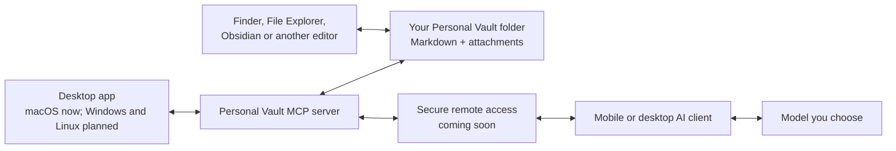

# Personal Vault

**Keep your AI memory in a folder you own — not inside one model or app.**

Personal Vault is a provider-neutral memory system built around ordinary readable files and an optional MCP server. The same design can run on macOS, Windows, Linux and an owner-controlled server. Desktop apps and remote/mobile connectors are clients of the same Vault — they are not separate storage systems.

[**Download the current preview for Mac — Apple Silicon (.dmg)**](https://github.com/personal-ai-systems/personal-vault-ui/releases/download/v0.1.0-preview.2/Personal.Vault-0.1.0-arm64.dmg)

[View release notes or download the ZIP](https://github.com/personal-ai-systems/personal-vault-ui/releases/tag/v0.1.0-preview.2) · [Report a problem](https://github.com/personal-ai-systems/personal-vault-ui/issues)

> **Current download, not product boundary:** the first packaged preview is for Macs with an Apple M-series chip. Windows, Linux, Intel Mac and secure mobile access are part of the cross-platform direction below, but their installers/connectors are not released yet.


<sub>Current development interface with synthetic demo data. The selected thought is a normal file at `Daily/2026/10/2026-10-07-daily-reflection.md`; both the filesystem location and the saved date remain visible. The downloadable preview may differ slightly.</sub>

## Why use it?

AI chat history is usually tied to one provider. If you move from one model to another, your useful context does not automatically move with you.

Personal Vault keeps that context outside the provider:

- **Your files stay yours.** Notes are Markdown files and attachments in a folder you choose.
- **You can change AI models.** The same folder can support OpenAI GPT or Codex, Anthropic Claude, Google Gemini, DeepSeek, Kimi, or local models such as Llama, Qwen and Mistral through a suitable client.
- **It works without AI.** Browse, search and edit the files in a desktop app, Finder, Windows File Explorer, Obsidian, VS Code or another Markdown editor.
- **AI access is optional.** Compatible clients can use the included local MCP interface to list, read, search, create and update files after you grant access.
- **There is no hidden canonical database.** If the app disappears, the folder is still readable.



## Platform support

Personal Vault is not intended to be tied to macOS. The current implementation is being released in small, testable steps:

| Platform or access path | Status | How it uses the Vault |
| --- | --- | --- |
| macOS Apple Silicon desktop app | **Preview available now** | Bundles the UI and local MCP server; files stay in the selected folder. |
| Core MCP server on macOS, Windows and Linux | **Source available; cross-platform CI being added** | Runs beside a readable folder using Node.js. Packaged service installers are still to be implemented. |
| Windows desktop app | **Coming soon** | Planned Electron installer using the same UI, MCP tools and ordinary files. |
| Linux desktop app | **Coming soon** | Planned package using the same UI, MCP tools and ordinary files. |
| Intel Mac desktop app | **Coming soon** | Requires a separate signed build and installation testing. |
| ChatGPT and other remote MCP clients | **Coming soon** | Connect through an authenticated HTTPS MCP endpoint or secure tunnel to the owner-controlled Vault host. |
| iPhone, iPad and Android | **Coming soon through compatible clients** | The phone acts as a client; it does not need direct access to the desktop filesystem. |
| iCloud Drive and Google Drive backup | **Planned** | Backup/restore for the readable folder, not a replacement hidden database. |

`localhost:8788` is only for software running on the same computer. A phone cannot reach that address on the Mac. Remote/mobile access must add authentication, HTTPS and an owner-controlled connection method; users should never expose the local port directly to the internet.

## Try the current Mac preview

### 1. Check your Mac

This preview requires an Apple Silicon Mac: M1, M2, M3, M4 or later.

On your Mac, choose **Apple menu → About This Mac**. Look for an **Apple M-series** chip. This build does not run on Intel Macs.

### 2. Download the installer

Download [**Personal.Vault-0.1.0-arm64.dmg**](https://github.com/personal-ai-systems/personal-vault-ui/releases/download/v0.1.0-preview.2/Personal.Vault-0.1.0-arm64.dmg).

The file is approximately 147 MB. You do not need Node.js, Terminal, an MCP client or an AI subscription to use the app.

### 3. Move the app to Applications

1. Open the downloaded DMG.
2. Drag **Personal Vault** into the **Applications** folder shown in the installer window.
3. Eject the Personal Vault installer.

### 4. Approve the first launch

The preview is not yet signed or notarized by Apple.

1. Open **Finder → Applications**.
2. Control-click or right-click **Personal Vault**, then choose **Open**.
3. In the warning dialog, choose **Open**.

If **Open** is not offered, try launching once, then open **System Settings → Privacy & Security**, scroll to **Security**, and choose **Open Anyway** for Personal Vault. Do not disable macOS security globally.

### 5. Choose a test folder

When the folder picker appears, choose a new empty folder, for example:

```text
Documents/Personal Vault Test
```

That folder is your Vault. The app does not upload it, convert it into a database or move existing files into it. The downloadable preview asks for the folder directly; a friendlier welcome screen is being prepared for a later build.

## Try it in five minutes

After the app opens:

1. Create a small Markdown note, such as `2026-10-07-my-thought.md`.
2. Add a few lines of text and save it.
3. Search for a word from the note.
4. Open the same file directly from the selected folder in Finder or another Markdown editor.
5. Try archiving the test note and restoring it.

The important result is simple: the note remains a normal file in the folder you selected.

Dates are not hidden metadata. If you want a chronological journal, keep the date in the file name and folder path so it remains visible in Personal Vault, Finder, Windows File Explorer and any Markdown editor.

## Use it with or without AI

### Without AI

Use the current Mac app, a future Windows/Linux app, or open the same folder with tools you already use. No AI account, connector or model is required.

### Give selected files to an AI

For an occasional task, attach selected Markdown files to any AI client that accepts file uploads. You decide which files leave the Mac.

### Connect a compatible AI client

The current app includes a local MCP service for controlled file operations. The same server can back future Windows/Linux apps and a secured remote connection. A compatible client can list, read, search, create, update, attach, archive and restore files in the selected Vault.

Personal Vault does **not** include model accounts or subscriptions, and it does not automatically connect every provider. Each client must be configured to read the relevant files or connect to the Vault. Switching models preserves the stored memory; it does not silently send that memory to the new provider.

### Use it from a phone

The intended mobile flow is:

1. Personal Vault remains on a computer or owner-controlled server with access to the readable folder.
2. The MCP service is made available through authenticated HTTPS or a secure tunnel.
3. ChatGPT or another compatible mobile client connects to that MCP service.
4. The user can inspect and approve what the AI reads or changes.

This remote/mobile packaging is **to be implemented**. The current local server already speaks MCP over Streamable HTTP, but the public product does not yet ship the secure remote setup or claim a verified ChatGPT mobile connection.

## What is stored?

There is no required internal layout. A Vault can be as simple as:

```text
Personal Vault/
├── Daily/
│   └── 2026/10/
│       └── 2026-10-07-daily-reflection.md
├── projects/
│   └── home-renovation.md
├── documents/
│   └── appliance-warranty.pdf
└── archive/
```

You can organise the folder in a way that makes sense to you. Attachments stay as ordinary files. Archived items move into a visible `archive/` folder and can be restored.

## Privacy and preview limitations

- Files remain in the folder you select unless you move, share or back them up yourself.
- The local service listens on the host computer's loopback interface rather than exposing the Vault to the network by default.
- The preview has no built-in cloud sync or backup. Keep your own backup.
- The current build is unsigned and not notarized.
- Automatic updates and Windows, Linux and Intel Mac installers are not available yet.
- This is an early test release, not a promise that every workflow is production-ready.

Please do not include private notes, credentials or personal information in public GitHub issues or screenshots.

## Get help or give feedback

- [Report a bug or request an improvement](https://github.com/personal-ai-systems/personal-vault-ui/issues)
- [Read the current release notes](https://github.com/personal-ai-systems/personal-vault-ui/releases/tag/v0.1.0-preview.2)
- [Read the short usage guide](docs/using-personal-vault.md)

When reporting a problem, include what you tried, what happened, and your operating-system version. Remove personal information from screenshots and sample files.

## For developers

This repository contains the portable readable-file engine and MCP interface. The companion [`personal-vault-ui`](https://github.com/personal-ai-systems/personal-vault-ui) repository contains the Electron interface and the first macOS packaging. Future Windows and Linux packages should bundle the same engine instead of introducing platform-specific storage.

### Run the MCP service locally

Requirements: Node.js 24 or later.

```sh
npm ci
PERSONAL_VAULT_ROOT=/path/to/a/test-folder \
MCP_HOST=127.0.0.1 \
MCP_PORT=8788 \
npm run mcp:vault
```

The local endpoint is `http://127.0.0.1:8788/mcp`. Use a temporary folder for development and tests — never point test commands at a real Vault.

### Available file operations

- list folders and files;
- read Markdown, text and JSON;
- create and update readable files;
- search text;
- save attachments beside Markdown notes;
- archive and restore files.

See the [API overview](docs/personal-vault-api.md), [desktop integration notes](docs/desktop-integration.md) and [provider-neutral context guide](docs/provider-neutral-context.md).

### Verify a change

```sh
npm test
npm run test:context
npm run scan:secrets
```

Tests use temporary folders, never the user's real Vault.

## License and maintenance

Maintained by **Personal AI Systems**. Source is available under the [Functional Source License 1.1, Apache 2.0 Future License](LICENSE).
