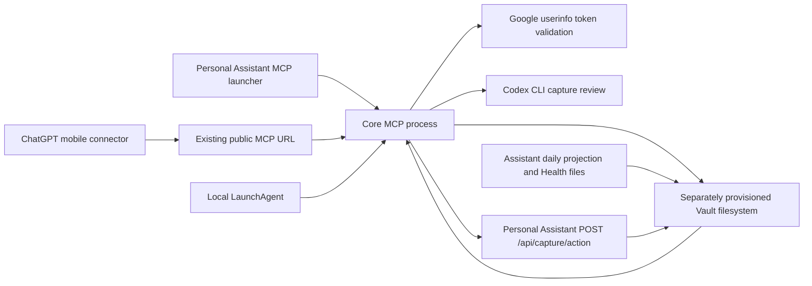

# Gate 1 Ownership and Dependency Inventory

- Status: reviewed working-tree and local-runtime inventory
- Evidence date: 19 August 2026
- Code baseline: `f56b0c6`

This document classifies the current repository and MCP surface before any compatibility behavior is moved or removed. It is an inventory, not a claim that the target architecture has already been implemented.

For conflicts, `AGENTS.md` remains authoritative.

## Classification

- **Core** — neutral storage, provenance, audit, retrieval, search, transport or product infrastructure that belongs in Personal Vault's Core layer.
- **Assistant** — domain interpretation, Today/Planner, Health, project routing, model orchestration or approval experience that belongs in Personal Assistant.
- **Compatibility adapter** — temporary behavior required by an existing client while an Assistant-owned equivalent and versioned migration path are introduced.
- **Migration-only** — code, schema, setting or documentation retained only to support the current extraction and migration.
- **Obsolete** — no longer needed and safe to remove only after consumer and rollback evidence exists.
- **Mixed: split required** — one current file or tool contains more than one ownership class and must be separated behind contracts before deletion.

## Current Dependency Graph

The target direction removes the Core-to-Codex and Core-to-Assistant domain dependencies. Core should retain the neutral Vault, transport and contract edges. Personal Assistant should consume Core rather than Core invoking Assistant processors.

## Tracked Path Ownership

| Path | Current contents | Classification | Target disposition |
| --- | --- | --- | --- |
| `.env.example` | Core listener, Vault root and Google authentication settings plus `DASHBOARD_BASE_URL` and capture-review provider settings | Mixed: split required | Keep neutral Core settings. Move Assistant/model settings out after client migration; delete `DASHBOARD_BASE_URL` last. |
| `.gitignore` | Repository, secret, log and live-Vault exclusions | Core | Keep and extend as packaging/fixture needs become concrete. |
| `AGENTS.md` | Authoritative product boundary, gates and work order | Core | Keep authoritative and update only for durable decisions/evidence. |
| `LICENSE` | FSL-1.1-ALv2 terms | Core | Keep; verify release-year/copyright metadata before public alpha. |
| `README.md` | Product overview, boundary and local start instructions | Core | Keep; make installation claims only after clean-install evidence. |
| `docs/development-handoff.md` | Durable decisions, debt and working context | Core | Keep synchronized with verified milestones. |
| `docs/core-contract-v1.md` | Proposed Core v1 contract and legacy-tool migration mapping | Core | Review before freezing; after approval, make incompatible changes only in a new contract version. |
| `docs/personal-vault-fluid-capture.md` | Core raw-first rule mixed with Assistant review, domain examples and heartbeat compatibility flow | Mixed: split required | Retain the generic capture/provenance contract in Core. Move review/interpretation/heartbeat workflow details to Assistant migration documentation. |
| `docs/ownership-matrix.md` | Gate 1 ownership and dependency evidence | Core | Maintain until all compatibility rows have an executed disposition. |
| `contracts/v1/core-contract-v1.schema.json` | Machine-readable neutral record, asset, provenance, audit, search, cursor and mutation definitions | Core | Validate with temporary redacted fixtures before runtime adoption. |
| `mcp/capture-review.schema.json` | Assistant review response and domain-oriented action IDs | Migration-only / Assistant | Move the review contract to Assistant. Replace any Core mutation schema with a neutral, versioned envelope defined by Core contract v1. |
| `mcp/personal-vault-server.mjs` | Neutral MCP transport and raw storage combined with Assistant interpretation and adapters | Mixed: split required | Extract neutral modules and contracts; keep compatibility shims only until equivalent Assistant endpoints and connector fixtures pass. |
| `package.json` | Core package metadata and MCP runtime dependencies | Core | Keep. Resolve package/server version mismatch and add test/CLI scripts in later approved steps. |
| `package-lock.json` | Reproducible Node dependency graph | Core | Keep synchronized with `package.json`. |

Generated `node_modules/`, `.DS_Store`, `.env`, logs and the live Vault are not tracked product paths and are not part of the ownership transfer.

## MCP Tool Ownership

The running local MCP process exposed these six tools during the audit. Tool discovery matched the current source file.

| Tool | Current behavior | Classification | Required target |
| --- | --- | --- | --- |
| `capture_note` | Saves raw Markdown/assets, then runs model/fallback interpretation and returns domain proposals/questions | Mixed: split required | Core keeps generic capture. Assistant owns interpretation and proposals. Preserve the public client journey through a versioned compatibility contract while switching the implementation. |
| `capture_asset` | Appends image bytes and Markdown links to an existing capture | Core, contract hardening required | Keep as generic asset storage, add stable record/asset IDs, broader declared asset policy, explicit mutation audit and safe path rules. |
| `apply_capture_action` | Loads a proposal and forwards it to Personal Assistant through `DASHBOARD_BASE_URL` | Compatibility adapter | Replace with a neutral approved-mutation Core contract plus Assistant-owned domain endpoint. Remove the reverse HTTP dependency after callers switch. |
| `get_today_plan` | Reads Assistant daily projection, groups project tasks and expands Health exercise prescriptions | Assistant exposed through compatibility adapter | Implement and serve from Personal Assistant. Keep only until mobile connector compatibility is proven. |
| `get_capture_review` | Reads proposal/model-review artifacts and returns Assistant-owned questions/actions | Compatibility adapter / Assistant | Move review retrieval to Assistant or an Assistant namespace. Core may retrieve the underlying generic artifact only by a neutral record contract. |
| `search_vault` | Searches Markdown plus hard-coded Health/project plan JSON shapes | Mixed: split required | Core keeps schema-neutral record/metadata/full-text search. Assistant owns domain-aware plan and exercise search/presentation. |

No new public domain verbs may be added during migration.

## Transitional Behavior Inside the MCP Server

Line references below describe the audited baseline and should be refreshed when the file changes.

| Source area | Current dependency or meaning | Classification | Migration action |
| --- | --- | --- | --- |
| `mcp/personal-vault-server.mjs:15-18` | Assistant base URL and Codex review process configuration | Migration-only | Move to Assistant/runtime migration configuration. |
| `mcp/personal-vault-server.mjs:42-62` | Loads the fluid-capture document into public server instructions and embeds Health/Today/project routing rules | Mixed: split required | Reduce Core instructions to neutral capture/search/provenance. Serve Assistant instructions from Assistant. |
| `mcp/personal-vault-server.mjs:65-172` | Health/activity, nutrition, project and planning regex classification plus domain clarification questions | Assistant | Move to Assistant processors; do not recreate these heuristics in Core. |
| `mcp/personal-vault-server.mjs:174-280` | Date/slug/asset handling and capture asset index | Core | Keep after contract, collision, path and audit hardening. |
| `mcp/personal-vault-server.mjs:282-380` | Vault path helpers and Google bearer-token validation | Core with security debt | Keep transport/auth boundary, but add explicit audience/scope/provider contract and symlink-safe root enforcement before release claims. |
| `mcp/personal-vault-server.mjs:380-460` | Markdown walking mixed with hard-coded `structured/health`, `structured/projects`, sessions and exercises | Mixed: split required | Keep schema-neutral search; move structured domain document adapters to Assistant. |
| `mcp/personal-vault-server.mjs:482-555` | Raw Markdown capture and capture/asset index writes | Core | Replace deterministic overwrite-prone filename behavior with stable append-safe record IDs and versioned envelope. |
| `mcp/personal-vault-server.mjs:557-574` | Reverse HTTP call to Assistant `/api/capture/action` | Compatibility adapter | Remove only after Assistant endpoint, connector switch, observation and rollback evidence. |
| `mcp/personal-vault-server.mjs:577-919` | Proposal normalization, Codex invocation, Health/nutrition/Today fallback heuristics and proposal artifacts | Assistant / migration-only | Move processor execution and schema to Assistant. Core may store resulting generic artifacts with provenance but must not interpret them. |
| `mcp/personal-vault-server.mjs:921-1288` | Six registered tools | Mixed: split required | Follow the tool matrix above and preserve compatibility fixtures before tool removal or semantic change. |
| `mcp/personal-vault-server.mjs:1294-1370` | Root, health check, OAuth metadata, CORS and Streamable HTTP MCP transport | Core | Keep, version and test as transport infrastructure. |

## Vault Filesystem Reads and Writes

| Vault location | Current operation | Meaning owner | Notes |
| --- | --- | --- | --- |
| `raw/YYYY/MM/*.md` | Create/read/append | Core | Canonical readable capture. Current filename generation can overwrite an earlier same-day capture with the same slug. |
| `raw/YYYY/MM/*.assets/*` | Create/read through Markdown | Core | Current decoder accepts image MIME types only despite broader future asset goals. |
| `indexes/captures.jsonl` | Append | Core | Rebuildability and stable event/audit semantics are not yet specified. |
| `indexes/capture-assets.jsonl` | Append | Core | Needs stable asset IDs, hashes and provenance contract. |
| `indexes/capture-proposals/*.json` | Read/write | Assistant artifact stored in Vault | Compatibility location; schema and ownership must move behind Assistant contract. |
| `indexes/capture-proposals.jsonl` | Append | Assistant artifact stored in Vault | Compatibility index; not a final Core public concept. |
| `indexes/codex-capture-reviews/*.json` | Read | Assistant artifact stored in Vault | Heartbeat compatibility path; no confirmed writer exists in this repository. |
| `tmp/capture-review-*.json` | Write/read | Migration-only | Codex output files are not removed by the current implementation. |
| `structured/plans/daily-projection.json` | Read | Assistant | Generated by Personal Assistant and consumed by `get_today_plan`. |
| `structured/health/*-plan.json` and `exercise-library.json` | Read/search | Assistant Health | Hard-coded domain search and Today expansion must leave Core. |
| `structured/projects/*-plan.json` | Read/search | Assistant/project modules | Hard-coded project-plan shapes must leave Core. |

The Assistant action endpoint additionally writes `indexes/capture-actions.jsonl`, `indexes/project-captures.jsonl`, `indexes/structured-updates.jsonl`, `structured/today/*` and Health-specific state/log/plan files. Those writes are not performed by neutral Core code today; the Core adapter triggers them through HTTP.

## Known Consumers and Runtime Owners

### Confirmed

- The installed local LaunchAgent starts `mcp/personal-vault-server.mjs` directly from this repository and currently owns the listener on port 8787.
- The existing ChatGPT connector is the intended remote MCP client through the current public URL. External connector invocation was not changed or re-tested during this read-only inventory.
- Personal Assistant's `mcp/personal-vault-server.mjs` is a 19-line compatibility launcher that resolves and starts the Core MCP server.
- Personal Assistant's `npm run mcp:vault` uses that launcher.
- Personal Assistant documentation and its mobile regression plan explicitly depend on `capture_note`, `apply_capture_action`, `get_today_plan` and `search_vault`.
- Personal Assistant's `POST /api/capture/action` receives the Core reverse call and owns the existing Today and Health mutations.
- Personal Assistant generates `structured/plans/daily-projection.json`, which the current Core `get_today_plan` tool reads.

### Exposed but consumer not yet proven

- `capture_asset` and `get_capture_review` are exposed by live tool discovery but are missing from the primary Assistant mobile tool list/test plan.
- There are no direct programmatic callers of the six MCP tool names in the tracked Core or Assistant application code; calls arrive through MCP clients.
- External mobile ChatGPT usage, cached tool schemas and public connector reachability require a separate connector acceptance run before any tool is removed or changed.

## Reverse Dependencies to Remove

1. Core -> Personal Assistant `POST /api/capture/action` through `DASHBOARD_BASE_URL`.
2. Core -> Assistant-generated Today/Health/project file shapes.
3. Core -> Codex executable and Assistant-owned capture-review prompt/schema.
4. Core instructions -> Assistant domain routing policy embedded in `docs/personal-vault-fluid-capture.md`.

Google token validation and the separately provisioned Vault filesystem are not reverse Assistant dependencies, but both need explicit versioned security/storage contracts.

## Risks Recorded During Inventory

These findings are not fixed by this documentation-only step:

1. Capture filenames are deterministic and `writeFile` can silently replace a previous same-slug capture, conflicting with the append-only rule.
2. The package version is `0.1.0` while the MCP server and health endpoint report `0.1.1`.
3. Core has no contract or regression tests, stable record IDs, change cursor, audit-event schema or rollback fixtures.
4. `safeRelativePath` is lexical and no explicit realpath/symlink confinement proof exists for the configured Vault root.
5. `capture_asset` can append to any existing Vault-relative `.md` path rather than a validated capture record.
6. Google `userinfo` validation is a compatibility authentication layer; token audience and tool-specific scope enforcement are not demonstrated.
7. Capture-review temp files accumulate and review artifacts do not have a frozen provenance/retention contract.
8. The live process loads repository instruction text at startup, so documentation changes do not affect its in-memory instructions until an explicitly approved restart.

## Gate 1 Inventory Exit Evidence

This inventory step is complete when:

- every tracked repository path and every currently registered MCP tool has a classification;
- Core-to-Assistant reverse dependencies and known consumers are listed;
- transitional domain behavior has a target owner and migration action;
- no compatibility behavior has been removed;
- syntax, dependency and documentation checks pass.

Core contract v1 is proposed in `docs/core-contract-v1.md` and `contracts/v1/core-contract-v1.schema.json`. The next bounded roadmap step is user review and freeze of that contract, followed by temporary-fixture contract tests and rollback fixtures; no runtime migration starts before those tests pass.
